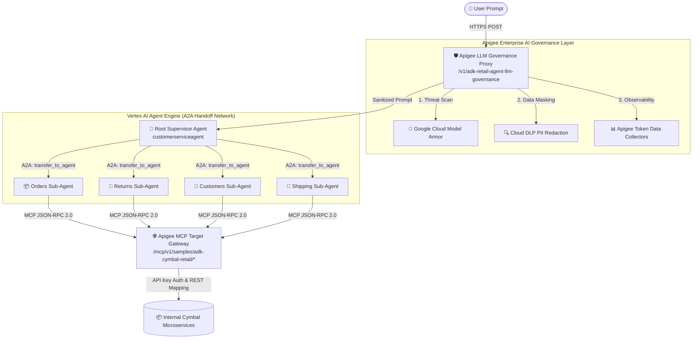

# Cymbal Retail: ADK & Apigee Enterprise AI Governance Showcase

[](https://cloud.google.com)
[](https://cloud.google.com/vertex-ai)
[](https://cloud.google.com/apigee)
[](https://modelcontextprotocol.io)

An enterprise demonstration reference project showcasing **Agent-to-Agent (A2A)** autonomous orchestration built with Google's **Agent Development Kit (ADK)** and **Vertex AI Agent Engine**, integrated with standardized **Model Context Protocol (MCP)** tool gateways, and fully governed by **Apigee API Management** (featuring **Google Cloud Model Armor** threat defense and **Cloud DLP** real-time PII sanitization).

---

## 🏛️ System Architecture



---

## ✨ Key Enterprise Capabilities

### 1. Autonomous Agent-to-Agent (A2A) Orchestration
Instead of forcing a single LLM prompt to navigate complex enterprise APIs, the architecture implements a **Supervisor / Worker network**:
* **`customerserviceagent` (Supervisor):** Clarifies customer intent and delegates execution context cleanly to domain workers.
* **Specialized Sub-Agents:** `ordersagent`, `returnsagent`, `customersagent`, and `shippingagent` operate with isolated system instructions and restricted tool permissions.

### 2. Unified MCP Tool Architecture
All backend microservices are exposed via Apigee as standardized **Model Context Protocol (MCP)** servers (`MCPToolset`). Agents negotiate tool lists and tool calls purely using JSON-RPC 2.0 over HTTP, eliminating the need for hardcoded credentials, complex auth flows, or dynamic OpenAPI parsers inside client agent code.

### 3. Apigee Enterprise AI Governance
Every LLM generation request is proxied through Apigee (`adk-retail-agent-llm-governance-v1`), enforcing:
* **Pre-Generation Threat Filtering (Model Armor):** Intercepts Prompt Injections, Jailbreaks, Hate Speech, and Malicious URIs before they reach Vertex AI.
* **On-the-Fly PII Redaction (Cloud DLP):** Executes transformation templates to mask Social Security Numbers, Credit Cards, and sensitive entries with `#`.
* **Token Cost Attribution & RAI Analytics:** XML Data Collectors record exact prompt, candidate, and thought token counts, compiling custom enterprise visual reports directly in Apigee Analytics.

---

## 📁 Repository Layout

```text
├── config/                  # Backend microservice OpenAPI specs & target YAMLs
├── proxies/                 # Apigee API Management proxy deployment bundles
│   ├── adk-retail-agent-llm-governance-v1/   # AI safety & token logging proxy
│   ├── mcp-generic-gateway-v1/               # Apigee MCP JSON-RPC host gateway
│   └── cymbal-shipping-v1/                   # Domain backend REST proxy
├── python/agents/           # ADK Python agent definitions & toolsets
│   ├── cymbal-retail-agent/                  # Standard retail agent
│   └── cymbal-retail-agent-governance/       # Governed Model Armor agent
├── sharedflowbundles/       # Reusable Apigee flows (LLM extraction & cloud logging)
├── test/integration/        # Apickli BDD Cucumber automated integration suites
├── deploy-adk-cymbal-retail-agent.sh         # Automated full GCP/Apigee deployer
├── deploy_mcp_configs.py                     # Deploy MCP configurations to Apigee KVM
├── generate_mcp_config.py                    # OpenAPI to MCP config generator
└── run_integration_tests.sh                  # Automated BDD verification runner
```

---

## 🚀 Getting Started & Local Testing

### Prerequisites
* Google Cloud CLI (`gcloud`) authenticated with Project Admin permissions.
* Python `>=3.12` with `virtualenv` / `poetry`.
* Node.js `>=18` (for BDD test execution).

### 1. Environment Configuration
Ensure your local agent environment file is configured with your active Google Cloud and Apigee hostname settings:
```bash
cd python/agents/cymbal-retail-agent-governance
cat <<EOF > .env
GOOGLE_CLOUD_PROJECT="your-gcp-project-id"
GOOGLE_CLOUD_LOCATION="us-central1"
APIGEE_HOSTNAME="your-org-endpoint.nip.io"
GOOGLE_GENAI_USE_VERTEXAI="TRUE"
MODEL_NAME="gemini-2.5-flash"
APIGEE_LLM="/v1/adk-retail-agent-llm-governance"
EOF
```

### 2. Run Local ADK Web UI
To interact with your agent network via video/audio/chat development server:
```bash
cd python/agents/cymbal-retail-agent-governance
adk web --env_file=.env cymbal_retail_agent_governance
```

### 3. Run Automated BDD Integration Suites
To execute live Apickli Cucumber validation against the Apigee Gateway proxies:
```bash
./run_integration_tests.sh
```

---

## ☁️ Production Deployment

To provision and deploy the entire enterprise infrastructure from scratch (including GCP Artifact Registry, Secret Manager, Cloud Run, BigQuery, Apigee API Hub registration, Data Collectors, and Vertex AI Reasoning Engine provisioning):

```bash
export PROJECT_ID="your-gcp-project-id"
export APIGEE_ENV="qa"
export APIGEE_HOST="your-apigee-host.nip.io"

./deploy-adk-cymbal-retail-agent.sh
```

---

## 📄 License
Copyright 2026 Google LLC. Licensed under the [Apache License, Version 2.0](LICENSE.txt).
